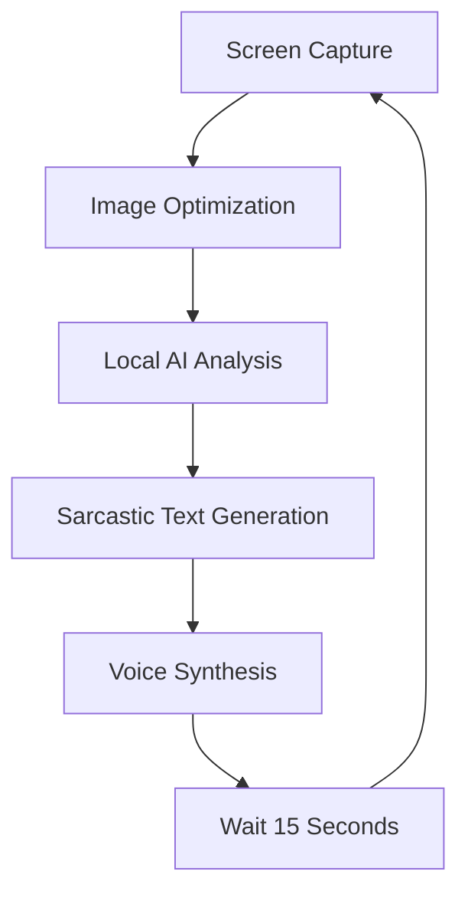

# Local-Screen-Oracle


System for cyclic monitoring and screen content analysis using local neural network models. The program performs screen capture, transmits the image to a multimodal model for interpretation, and outputs the text result via a speech synthesizer. All computations are performed locally.

## Libraries Used
* **mss**: High-performance screen capture.
* **Pillow (PIL)**: Image processing, resizing, and optimization.
* **pyttsx3**: Offline text-to-speech synthesis.
* **ollama**: Library for interacting with the local AI API.
* **io, time**: System modules for data streams and time intervals.

## System Requirements
To run this project, you must have the **Ollama** environment installed.
* Ollama Project: [https://ollama.com/](https://ollama.com/)
* Moondream Model: [https://ollama.com/library/moondream](https://ollama.com/library/moondream)

## Installation

### 1. Model Preparation
After installing Ollama, download the Moondream model using your terminal:
```bash
ollama pull moondream
```

### 2. Python Dependencies
Install the required packages via pip:
```bash
pip install mss Pillow pyttsx3 ollama
```

### Usage
Run the main script using the following command:
```Bash
python local.py
```

### Technical Features
* Privacy: No data is sent to external servers; analysis is performed entirely within the local Ollama instance.
* Optimization: Screenshots are resized to 768x768 before processing to ensure high performance and lower latency.
* Customization: The tone of the AI responses can be adjusted via the system prompt in the analyze_speak function.

### Project Workflow
The following diagram describes the internal logic of the application:


The program operates in an infinite loop with a 15-second interval. To stop the process, use the Ctrl+C shortcut.
